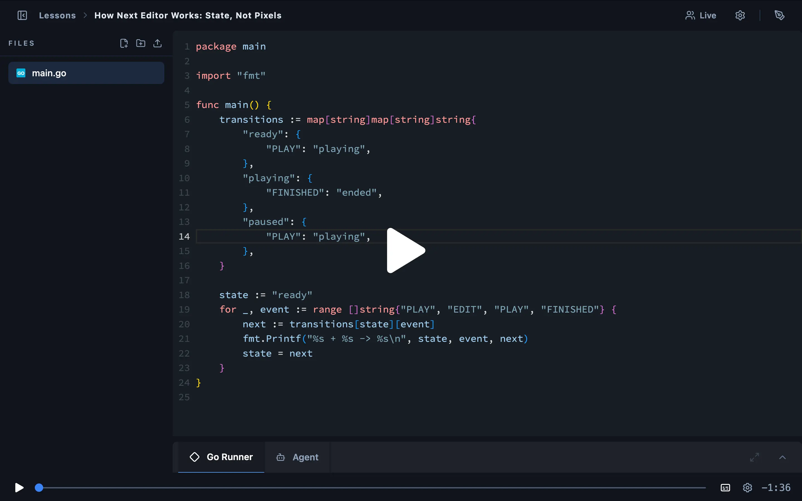

# Hi, I'm Chan Nyein Tun 👋

**I build for the web, the terminal, and the chain — mostly in TypeScript and Go.**

  
  

- 🧑‍💻 Six years of shipping product frontends (React / Next.js) and backends (Node, Go, Java)
- ⛓️ Built Web3 features with Fireblocks WaaS, Ethers.js, and smart-contract integrations
- 🤖 All-in on LLM-assisted engineering — building my own coding agent to understand the loop end to end

---

## 🛠️ What I'm building

###  Next Editor

**[nexteditor.dev](https://nexteditor.dev)** · **[source](https://github.com/channyeintun/next-editor)** · TypeScript

A browser-based recorder and replay engine for real, multi-file coding lessons. It captures the whole workspace — editor changes, live preview, terminal, HTTP calls, slides, captions, audio, even the instructor camera — and replays everything from a single timeline. Recordings stream as `.ne` files that start playing before they finish downloading, and Yjs-powered live rooms with voice chat make lessons collaborative. Built with Monaco, WebContainers, rrweb, and Cloudflare Workers.

🎬 Its **Studio** is something that doesn't exist anywhere else yet: an AI lesson-production pipeline inside the editor. A director compiles authored scripts into deterministic performances — typing the code in the real editor, drag-highlighting exactly what the narration explains, running it live — with in-browser TTS narration linted by an editorial critic. Every render must pass mechanical QA and a two-render repeatability check before a human reviews and publishes it.

### 🌊 Nami

**[github.com/channyeintun/nami](https://github.com/channyeintun/nami)** · Go

An agentic coding CLI powered by LLMs — think, plan, and execute code changes without leaving the terminal. A Go engine drives the agent loop, tool execution, and permission gating; a custom TUI (**Silvery**) streams the session; and plans, task lists, and walkthroughs persist as first-class, reviewable artifacts. Works with Anthropic, OpenAI, Google, DeepSeek, Groq, Mistral, Ollama, and GitHub Copilot.

---

## 🤖 Agentic coding

Most of my work now starts as a prompt, a plan, and a review. The agents I actually keep open:

  
  
  
  
  

---

## 🧰 Toolbox

**Frontend**

  
  
  
  
  
  
  
  
  
  
  

**Backend**

  
  
  
  
  
  
  
  
  

**Delivery**

  
  
  
  
  
  
  

**Web3 · AI**

  
  
  
  

---

If **Next Editor** or **Nami** looks useful to you, a ⭐ goes a long way.

