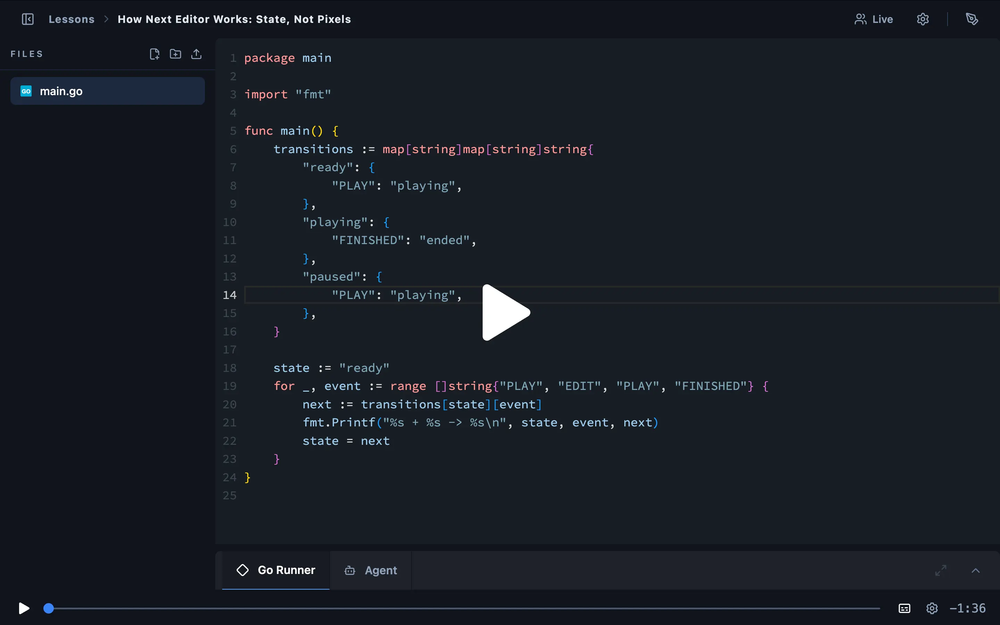

# Hi, I'm Chan Nyein Tun 👋

**Tech Lead · Senior Full-Stack Engineer — TypeScript, React, Next.js, Node.js**

6 years shipping products for teams in Singapore, Japan and Myanmar · Open to roles in Singapore, Bangkok, Ho Chi Minh City or remote

  
  
  
  

- 🧭 **Tech Lead at BinaryLab**, leading delivery of a platform built with Next.js, NestJS and PostgreSQL
- 🧑‍💻 Previously frontend lead for two Mastodon-based social networks and engineer on products for Sheng Siong (Singapore) and Anicana, a Web3 platform (Japan)
- 🤖 All-in on LLM-assisted engineering, and building my own coding agent to understand the loop end to end

---

## 🛠️ What I'm building

###  Next Editor — coding lessons you can pause, edit and run

**[nexteditor.dev](https://nexteditor.dev)** · **[source](https://github.com/channyeintun/next-editor)** · TypeScript · 2,100+ commits

A browser-based recorder and replay engine for real, multi-file coding lessons. It captures the whole workspace — editor changes, live preview, terminal, HTTP calls, slides, captions, audio, even the instructor camera — and replays everything from a single timeline. Recordings stream as `.ne` files that start playing before they finish downloading, and Yjs-powered live rooms with voice chat make lessons collaborative. Built with React 19, XState, Monaco, WebContainers, a Rust→WebAssembly diff codec, and Cloudflare Workers.

🎬 Its **Studio** is an AI lesson-production pipeline inside the editor. A director compiles authored scripts into deterministic performances — typing the code in the real editor, highlighting exactly what the narration explains, running it live — with in-browser TTS narration reviewed by an editorial critic. Every render must pass mechanical QA and a two-render repeatability check before a human reviews and publishes it.

**▶ Try a lesson** — press pause at any point and edit the code yourself:

| Lesson | What it shows |
| --- | --- |
| [How Next Editor Works: State, Not Pixels](https://nexteditor.dev/learn/how-next-editor-works-state-not-pixels) | The architecture, explained inside the editor itself |
| [Introduction to NextEditor](https://nexteditor.dev/learn/introduction) | A tour of recording, playback and the live workspace |
| [Go](https://nexteditor.dev/learn/go-crash-course) · [Kotlin](https://nexteditor.dev/learn/kotlin-crash-course) · [Zig](https://nexteditor.dev/learn/zig-crash-course) · [Haskell](https://nexteditor.dev/learn/haskell-crash-course) crash courses | Studio-produced lessons running real toolchains |
| [x86-64 Assembly Crash Course](https://nexteditor.dev/learn/x86-64-assembly-crash-course) | Runs on an assembler + CPU emulator written in TypeScript, no server |
| [Kite Crash Course](https://nexteditor.dev/learn/kite-crash-course) | My own language, compiled to WebAssembly in the page |

📝 Write-up: [I Built an Interactive Code Recording Engine with XState Instead of Recording Videos](https://channyeintun.gitbook.io/blogs/engineering/i-built-an-interactive-code-recording-engine-with-xstate-instead-of-recording-videos)

###  Nami

**[github.com/channyeintun/nami](https://github.com/channyeintun/nami)** · Go

An agentic coding CLI powered by LLMs — think, plan, and execute code changes without leaving the terminal. A Go engine drives the agent loop, tool execution, and permission gating; a custom TUI (**Silvery**) streams the session; and plans, task lists, and walkthroughs persist as first-class, reviewable artifacts. Works with Anthropic, OpenAI, Google, DeepSeek, Groq, Mistral, Ollama, and GitHub Copilot.

### 🐘 Next Mastodon

**[source](https://github.com/channyeintun/next-mastodon)** · Next.js 16

A fast Mastodon web client with real-time streaming, chat-style DMs, PWA push notifications, a Wrapstodon year-in-review and 10 languages including Burmese. Built with React 19, TanStack Query and deployed on Cloudflare via OpenNext.

###  Kite

**[kite-lang.dev](https://kite-lang.dev)** · **[source](https://github.com/channyeintun/kite-lang)** · Rust

A statically compiled language for WebAssembly. Most of the work goes into keeping it small enough to read: few keywords, no hidden control flow, errors you can't ignore by accident. The compiler, `kitec`, is written in Rust.

---

## ✍️ Writing

35+ articles in English and Burmese on [my GitBook](https://channyeintun.gitbook.io/blogs). A few favourites:

- [The Anatomy of an Agent Harness](https://channyeintun.gitbook.io/blogs/ai/the-anatomy-of-an-agent-harness)
- [Harness Engineering: How to Build Software When Humans Steer, Agents Execute](https://channyeintun.gitbook.io/blogs/ai/harness-engineering-how-to-build-software-when-humans-steer-agents-execute)
- [XState Under The Hood](https://channyeintun.gitbook.io/blogs/javascript/xstate-under-the-hood)
- [JS Closure Memory Leaks](https://channyeintun.gitbook.io/blogs/javascript/js-closure-memory-leaks)
- [Memory Alignment in Go](https://channyeintun.gitbook.io/blogs/go/memory-alignment-in-go)
- [Web Accessibility](https://channyeintun.gitbook.io/blogs/accessibility/web-accessibility)

---

## ❯ Agentic coding

Most of my work now starts as a prompt, a plan, and a review. The agents I actually keep open:

  
  
  
  

---

## 🧰 Toolbox

**Frontend**

  
  
  
  
  
  
  
  
  
  
  

**Backend**

  
  
  
  
  
  
  
  
  
  
  

**Delivery**

  
  
  
  
  
  
  
  
  

**Web3 · AI**

  
  
  
  

---

If **Next Editor**, **Nami**, or **Kite** looks useful to you, a ⭐ goes a long way.

